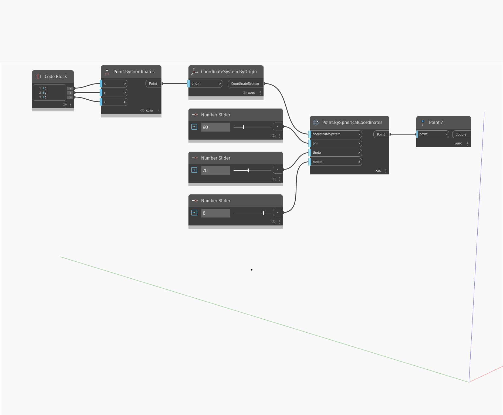

## In profondità
`Point.Z` restituisce il valore z dello spazio globale di un punto di input.

Nell'esempio seguente, viene utilizzato `Point.BySphericalCoordinates` per creare un punto e quindi viene utilizzato `Point.Z` per restituire la coordinata z.

___
## File di esempio

