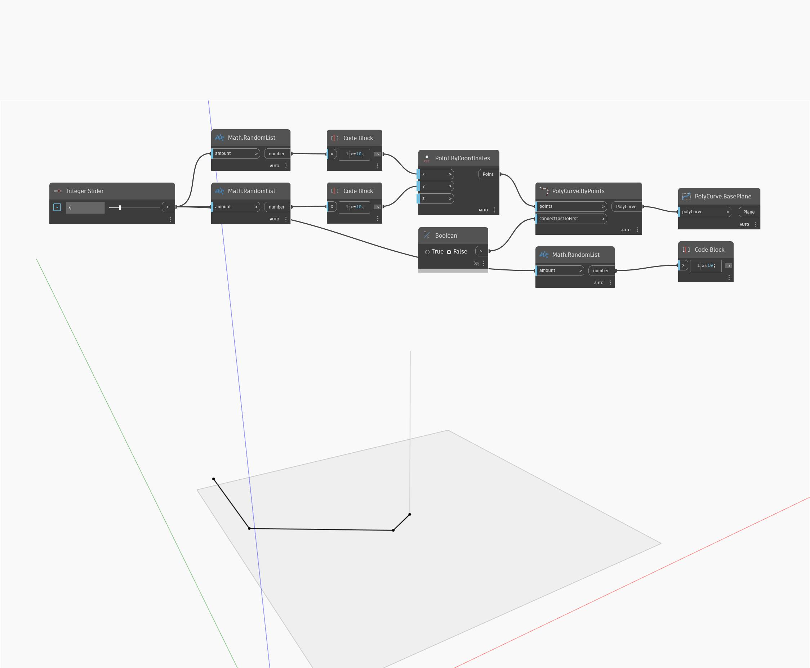

## In profondità
BasePlane restituirà il piano di una PolyCurve piana. Se la curva non è piana, verrà generato un errore. Nell'esempio seguente, viene generato un insieme di punti casuali e si utilizza PolyCurve.ByPoints per creare una PolyCurve. Poiché sono state utilizzate solo coordinate x e y, la PolyCurve generata è piana nel piano XY globale.
___
## File di esempio

