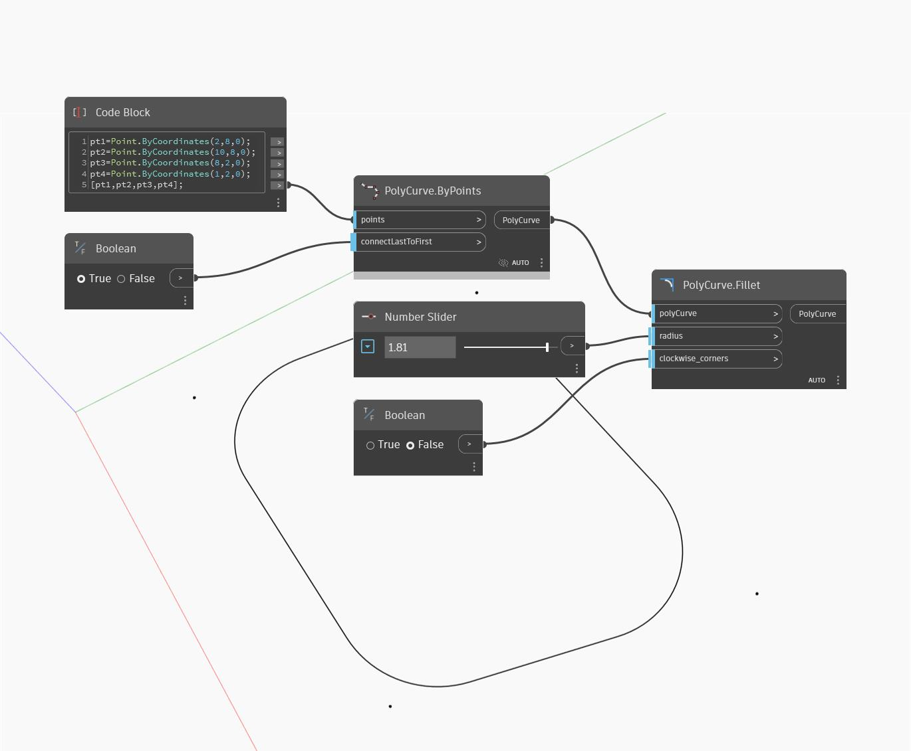

## In profondità
Fillet restituirà un nuovo solido con bordi arrotondati. L'input edges specifica quali bordi raccordare, mentre l'input offset determina il raggio del raccordo. Nell'esempio seguente, si inizia con un cubo utilizzando gli input di default. Per ottenere i bordi appropriati del cubo, si esplode prima il cubo per ottenere le facce come elenco di superfici. Si utilizza quindi un nodo Face.Edges per estrarre i bordi del cubo. Si estrae il primo bordo di ciascuna faccia con GetItemAtIndex. Un Number Slider controlla il raggio di ciascun raccordo.
___
## File di esempio

