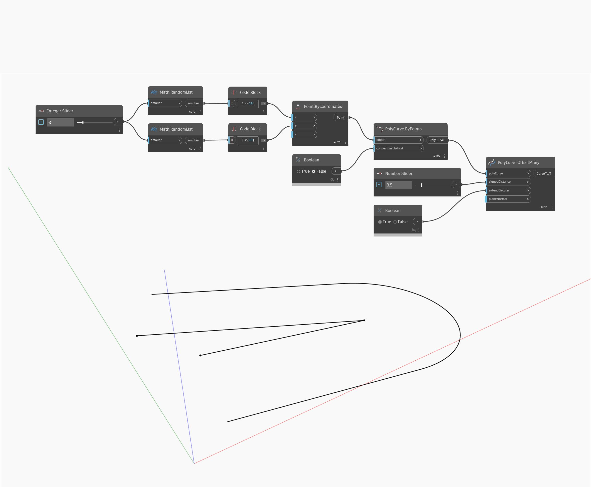

## In profondità
Offset creerà una nuova superficie che viene sottoposta ad offset dalla superficie di input alla distanza specificata dall'input distance. Una distanza positiva creerà la superficie di offset in base alla direzione normale della superficie, mentre una distanza negativa determinerà l'offset sul lato opposto della superficie. Nell'esempio seguente, viene prima creata una superficie utilizzando un nodo BySweep2Rails. Viene quindi utilizzato un Number Slider per controllare la distanza dell'offset in un nodo Offset.
___
## File di esempio

