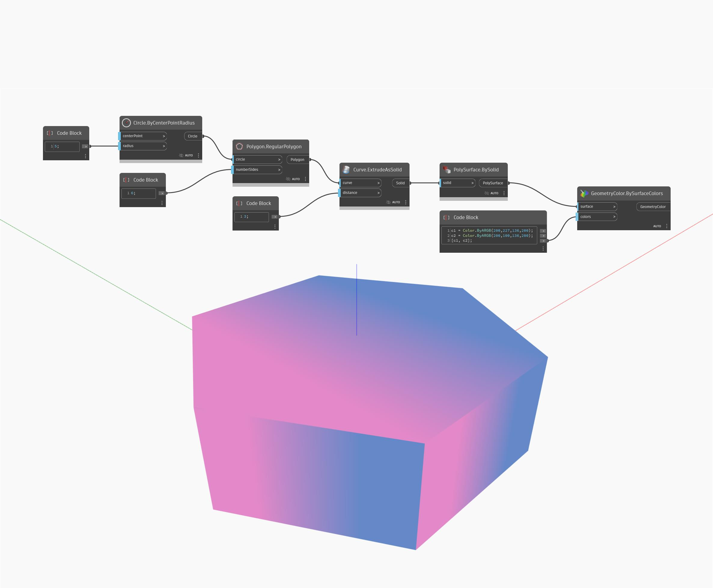

## In profondità
BySolid restituirà una PolySurface da un solido. Nell'esempio seguente, viene restituito un solido come PolySurface affinché sia un input accettabile per Display.BySurfaceColors.
___
## File di esempio

