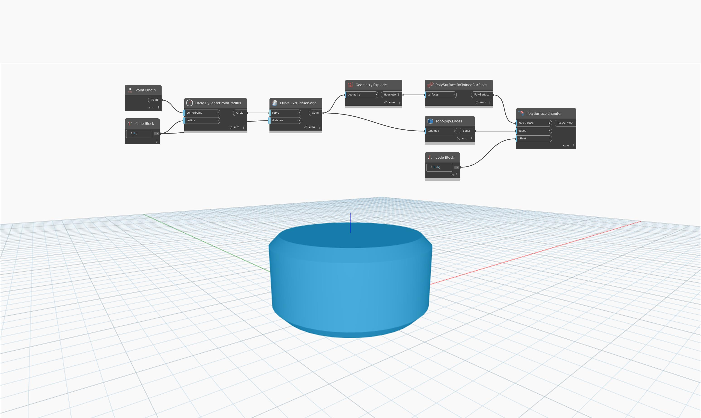

## In profondità
`PolySurface.Chamfer` restituisce una nuova PolySurface con bordi smussati definiti dall'input `offset`.

Nell'esempio seguente, viene restituita una nuova PolySurface smussando i bordi superiore e inferiore di un cilindro di un offset di 0.5. L'input di offset deve essere sufficientemente piccolo da adattarsi alla PolySurface. Questo nodo è simile a `PolySurface.Fillet`, ma restituisce una PolySurface con nuovi bordi.

___
## File di esempio

