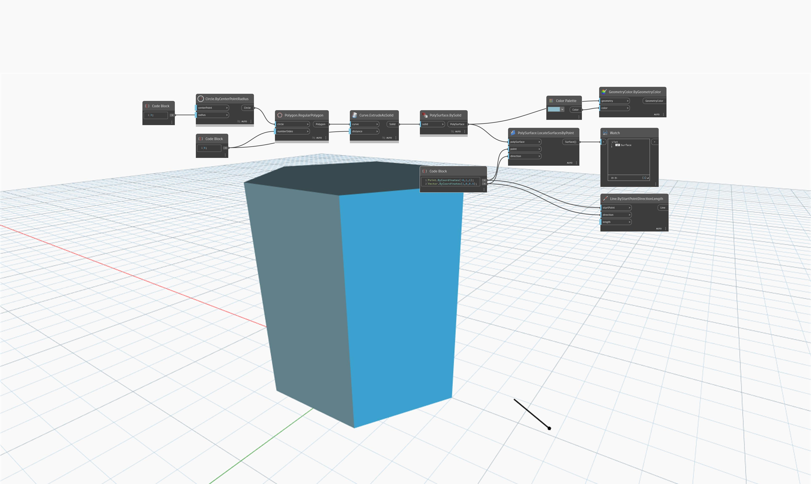

## In profondità
`PolySurface.LocateSurfacesByPoint` restituisce la prima superficie intersecata nella direzione di avanzamento come definito da un vettore.

Nell'esempio seguente, la superficie restituita viene intersecata da un vettore che ha origine in corrispondenza del punto. Il vettore viene rappresentato come una linea.

___
## File di esempio

