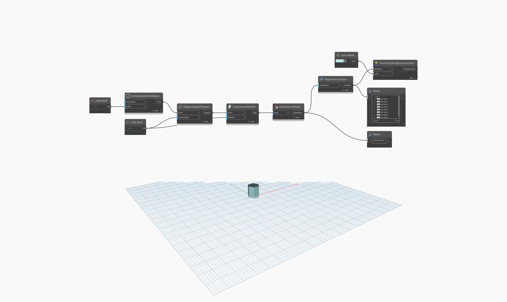

## In profondità
`PolySurface.Surfaces` restituisce le superfici che costituiscono una PolySurface.

Nell'esempio seguente, `PolySurface.Surfaces` viene utilizzato per restituire otto superfici singole da un esagono estruso.

___
## File di esempio

