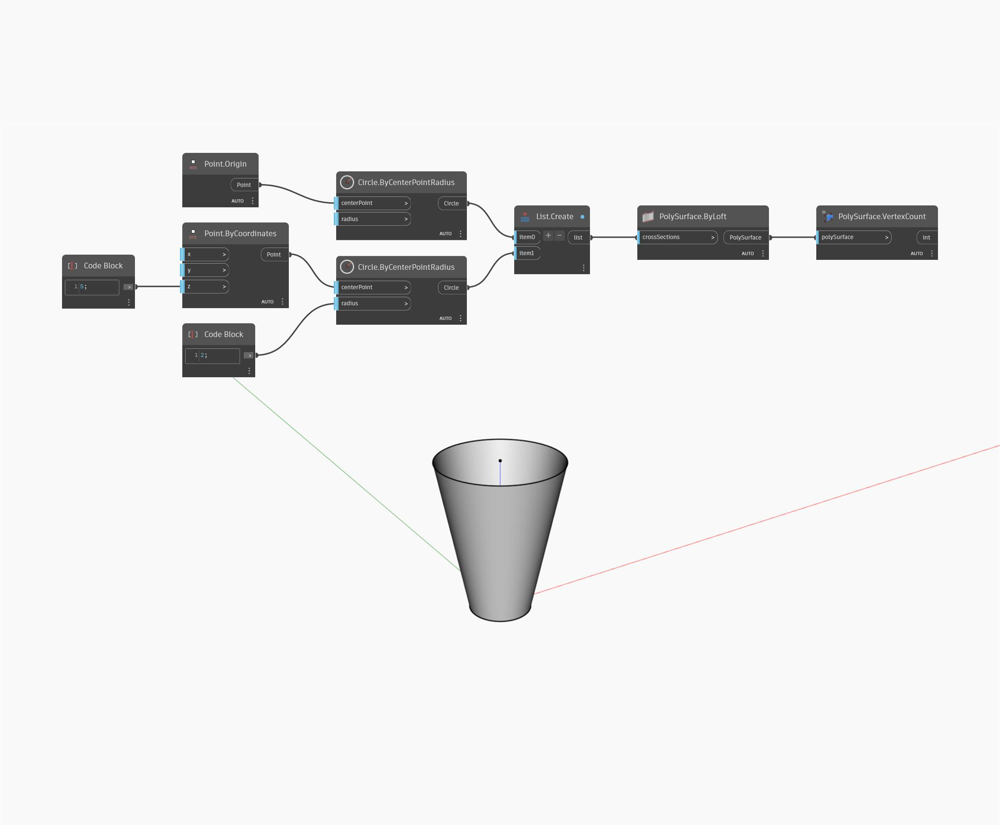

## In profondità
VertexCount restituirà il numero di vertici di una PolySurface come numero intero. Nell'esempio seguente, un esagono estruso restituisce un conteggio di vertici pari a 12. I vertici sono rappresentati come punti.
___
## File di esempio

