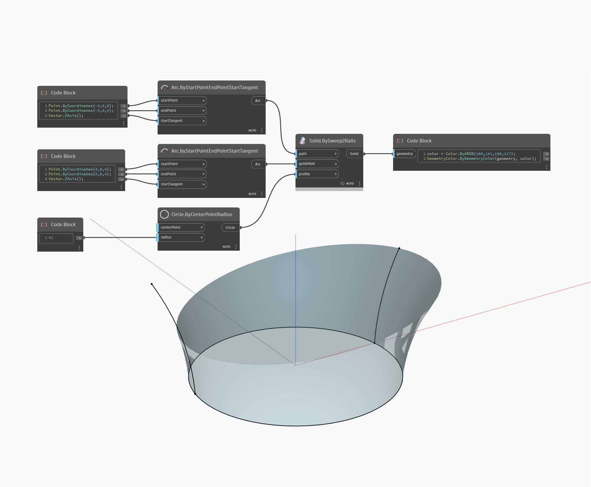

## In profondità
`Solid.BySweep2Rails` restituisce un nuovo solido da un profilo di curva con estrusione su percorso lungo due guide della curva.

Nell'esempio seguente, viene restituito un nuovo solido dall'estrusione su percorso di un cerchio lungo due archi come guide. Se si alternano gli input dell'arco `path` e `guideRail`, verrà modificato l'arco rispetto a cui è perpendicolare l'estrusione su percorso.

___
## File di esempio

