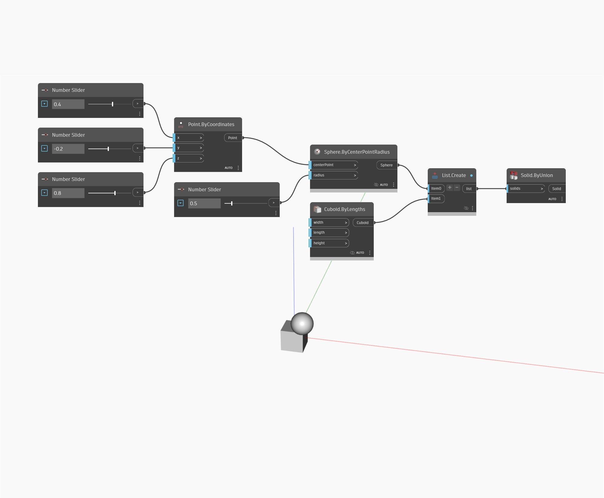

## In profondità
Solid.ByUnion creerà un nuovo solido singolo dall'unione di un elenco di solidi chiusi. L'unione è la combinazione di entrambi i solidi e il nuovo solido includerà tutto il volume dei solidi originali. Nell'esempio seguente, si utilizzerà un insieme di Number Slider per controllare la posizione e il raggio di una sfera. Si utilizza anche un cuboide di default. Si utilizza un nodo List.Create per inserire sia il cubo che la sfera in un unico elenco, che viene utilizzato come input per il nodo Solid.ByUnion.
___
## File di esempio

