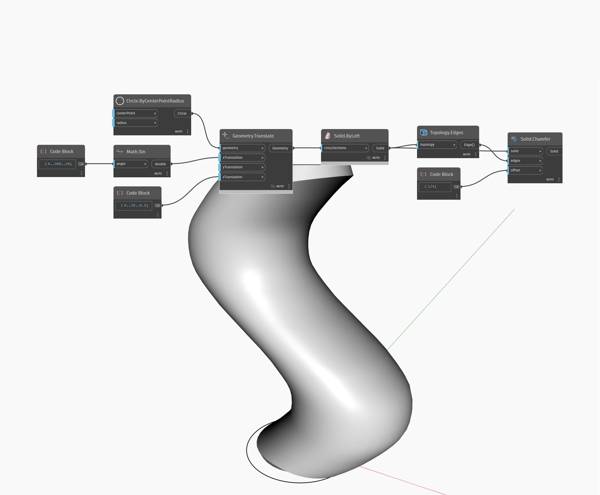

## In profondità
Chamfer restituirà un nuovo solido con bordi smussati. L'input edges specifica quali bordi smussare, mentre l'input offset determina l'estensione dello smusso. Nell'esempio seguente, si inizia con un cubo utilizzando gli input di default. Per ottenere i bordi appropriati del cubo, prima si esplode il cubo per ottenere le facce come elenco di superfici. Si utilizza quindi il nodo Face.Edges per estrarre i bordi del cubo. Si estrae il primo bordo di ogni faccia con GetItemAtIndex. Un Number Slider controlla la distanza di offset per lo smusso.
___
## File di esempio

