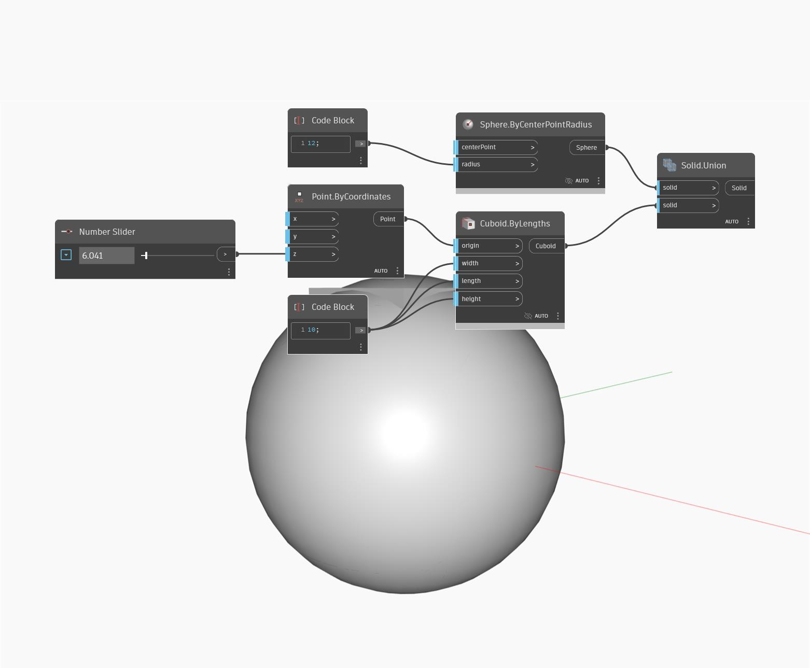

## In profondità
Union creerà un nuovo solido aggiungendo un solido all'altro. L'input "solid" indica il solido a cui aggiungere, mentre l'input "tool" è il solido che verrà aggiunto. Nell'esempio seguente, si inizia con un cubo di default come solido a cui si intende aggiungere. Si utilizza una serie di Number Slider per controllare la posizione e il raggio di una sfera, che si utilizza come strumento. Se la sfera interseca il cubo, il risultato è un cubo con la parte intersecante della sfera aggiunta ad essa.
___
## File di esempio

