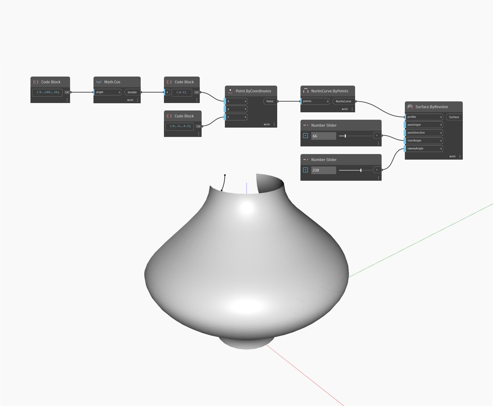

## In profondità
Solid.ByRevolve crea una superficie ruotando una determinata curva di profilo attorno ad un asse. L'asse è definito da un punto axisOrigin e da un vettore axisDirection. L'angolo iniziale determina dove iniziare la superficie, misurata in gradi, e sweepAngle determina la distanza attorno all'asse per continuare la superficie. Nell'esempio seguente, si utilizzano una curva generata con una funzione coseno come curva di profilo e due Number Slider per controllare sweepAngle. Per axisOrigin e axisDirection vengono lasciati i valori di default dell'origine globale e dell'asse Z globale per questo esempio.
___
## File di esempio

