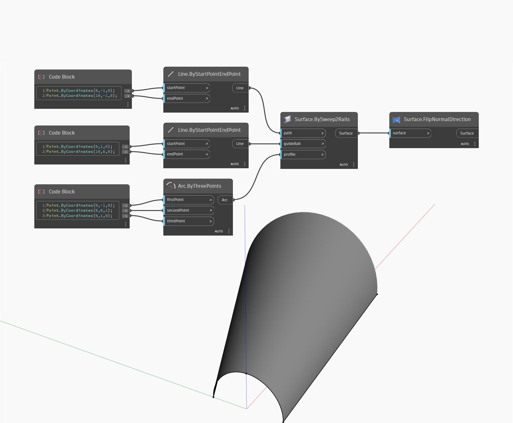

## In profondità
FlipNormalDirection inverte la direzione dei vettori della normale di una superficie. Nell'esempio seguente, viene prima creata una superficie utilizzando BySweep2Rails. La direzione della normale di questa superficie punta verso l'alto nella direzione Z positiva. Utilizzando un nodo FlipNormalDirection, si crea una nuova superficie con la stessa geometria, ma con le normali rivolte verso il basso nella direzione Z negativa.
___
## File di esempio

