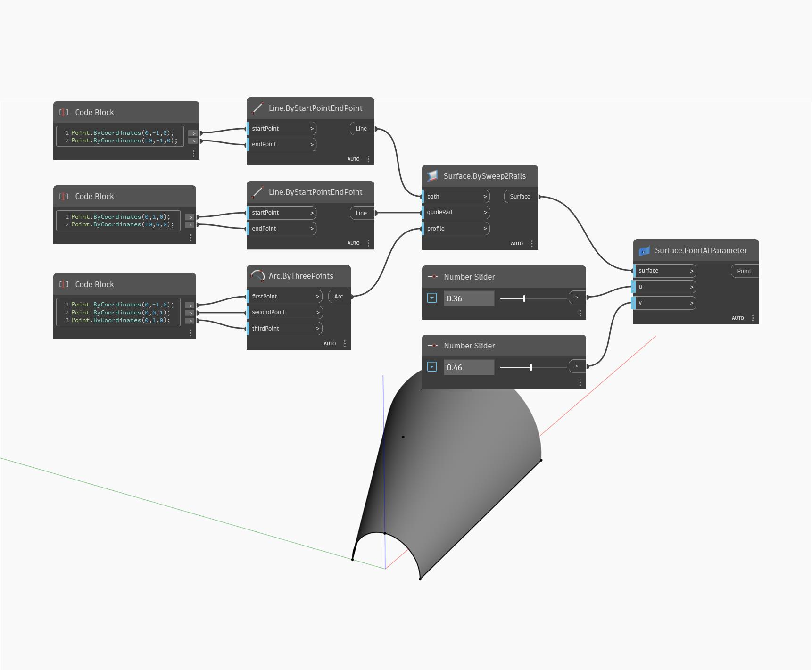

## In profondità
PointAtParameter restituirà il punto su una superficie specificata dai parametri U e V. Nell'esempio seguente, viene prima creata una superficie utilizzando un nodo BySweep2Rails. Vengono quindi utilizzati due Number Slider per controllare i valori U e V del parametro per un nodo PointAtParameter.
___
## File di esempio

