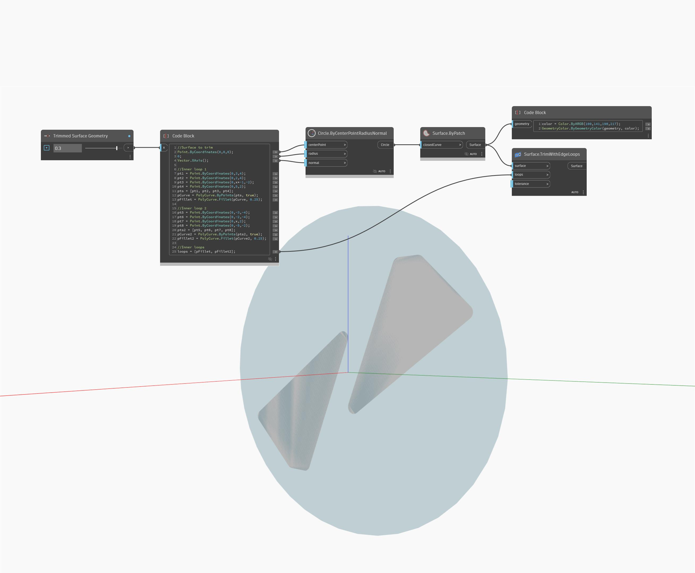

## In profondità
TrimWithEdgeLoops restituirà una nuova superficie ritagliata da una superficie di input. Nell'esempio seguente, vengono tagliati due perimetri da una superficie, restituendo due nuove superfici evidenziate in blu. Il Number Slider regolerà la forma delle nuove superfici. L'input delle linee chiuse utilizzerà una singola PolyCurve o un elenco di esse.
___
## File di esempio

