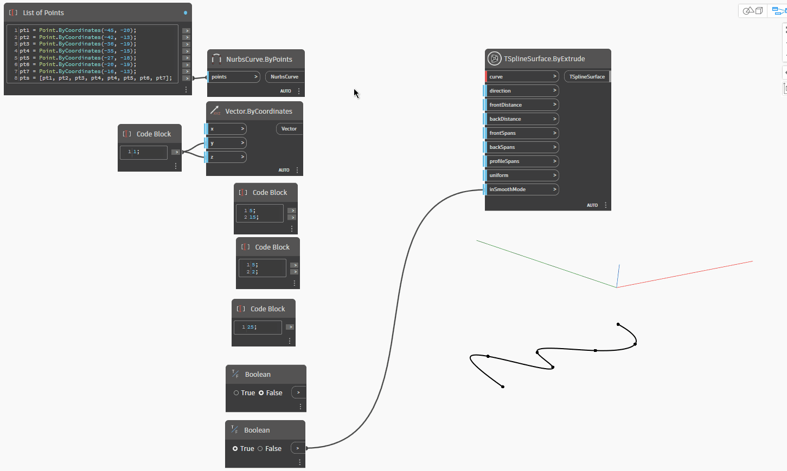

## In-Depth
Nell'esempio seguente, una superficie T-Spline viene creata come estrusione di un determinato valore `curve` di profilo. La curva può essere aperta o chiusa. L'estrusione viene eseguita in una direzione reale e può essere in entrambe le direzioni, controllata dagli input `frontDistance` e `backDistance`. Le campate possono essere impostate singolarmente per le due direzioni di estrusione, con i valori specificati `frontSpans` e `backSpans`. Per definire la definizione della superficie lungo la curva, `profileSpans` controlla il numero di facce e `uniform` le distribuisce in modo uniforme o tiene conto della curvatura. Infine, `inSmoothMode` controlla se la superficie è visualizzata in modalità uniforme o riquadro.

## File di esempio

