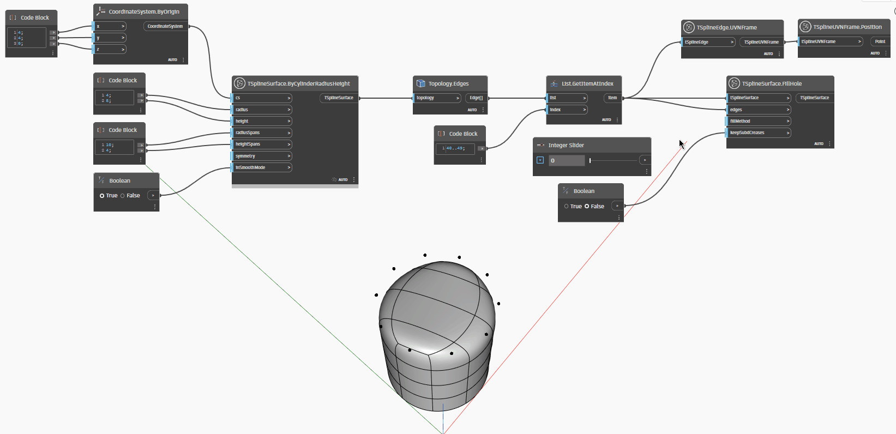

## In profondità
Nell'esempio seguente, gli spazi in una superficie cilindrica T-Spline vengono riempiti utilizzando il nodo `TSplineSurface.FillHole`, che richiede i seguenti input:
- `edges`: un numero di bordi selezionati dalla superficie T-Spline da riempire
- `fillMethod`: un valore numerico compreso tra 0 e 3 che indica il metodo di riempimento:
    * 0 riempie il foro con la tassellazione
    * 1 riempie il foro con una singola faccia NGon
    * 2 crea un punto al centro del foro da cui le facce triangolari si irradiano verso i bordi
    * 3 è simile al metodo 2, con la differenza che i vertici centrali sono saldati in un vertice invece che semplicemente impilati sopra.
- `keepSubdCreases`: un valore booleano che indica se le triangolazioni secondarie vengono mantenute.
___
## File di esempio

