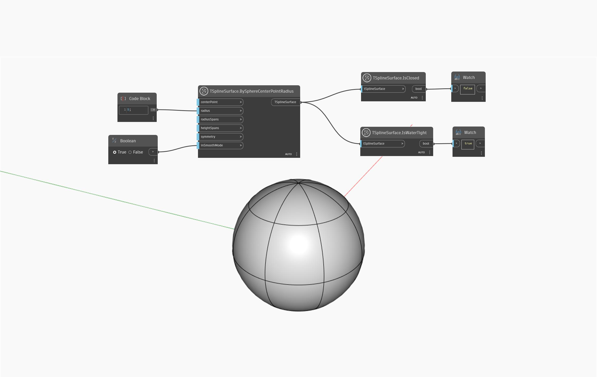

## In profondità
Le superfici T-Spline a tenuta ermetica sono geometrie che, se sommerse in un liquido, non permettono la fuoriuscita di alcun fluido.

Nell'esempio seguente, il nodo `TSplineSurface.IsWaterTight` viene utilizzato sulla primitiva di una sfera T-Spline, restituendo un valore `true`. Questo illustra uno dei casi in cui una superficie T-Spline, sebbene aperta (i vertici non sono saldati ai poli della sfera), è a tenuta stagna.
___
## File di esempio

