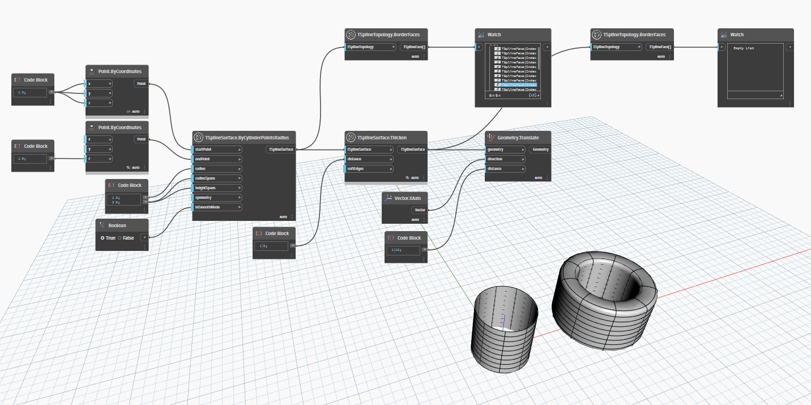

## In profondità
`TSplineTopology.BorderFaces` restituisce l'elenco di facce dei bordi contenute nella superficie T-Spline.

Nell'esempio seguente, vengono create due superfici T-Spline mediante `TSplineSurface.ByCylinderPointsRadius`. Una è una superficie aperta, l'altra è ispessita utilizzando `TSplineSurface.Thicken`, che la trasforma in una superficie chiusa. Quando entrambe le superfici vengono esaminate con il nodo `TSplineTopology.BorderFaces`, la prima restituisce un elenco di facce dei bordi mentre la seconda restituisce un elenco vuoto. Questo perché, essendo la superficie racchiusa, non ci sono facce dei bordi.
___
## File di esempio

