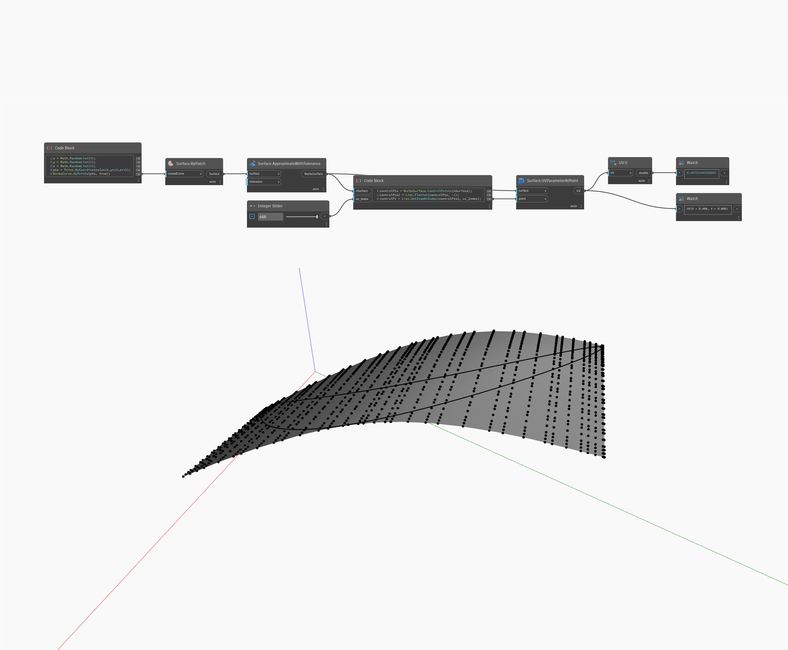

## In profondità
U restituirà il valore U di una coordinata UV. Nell'esempio seguente, viene restituito il valore U della posizione di un punto su NurbsSurface. Il parametro UV viene restituito dal nodo Surface.UVParamterAtPoint.
___
## File di esempio

