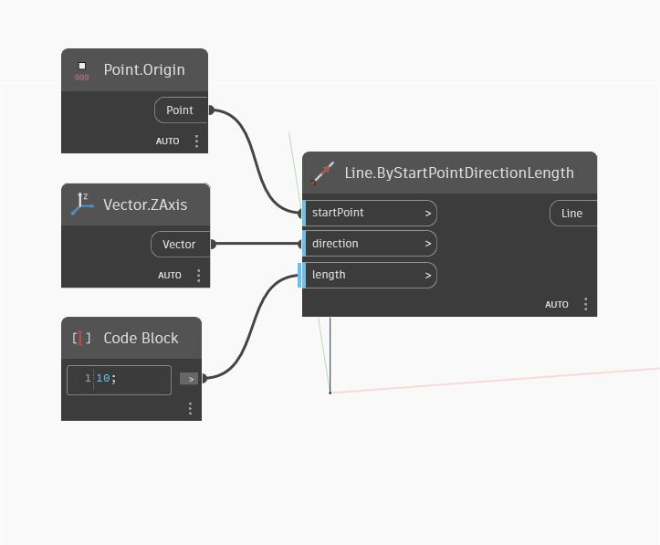

## In profondità
ZAxis restituirà un vettore che rappresenta l'asse Z di WorldCoordinateSystem. Nell'esempio seguente, il vettore restituito viene utilizzato per creare una linea che segue l'asse Z del sistema WCS.
___
## File di esempio

