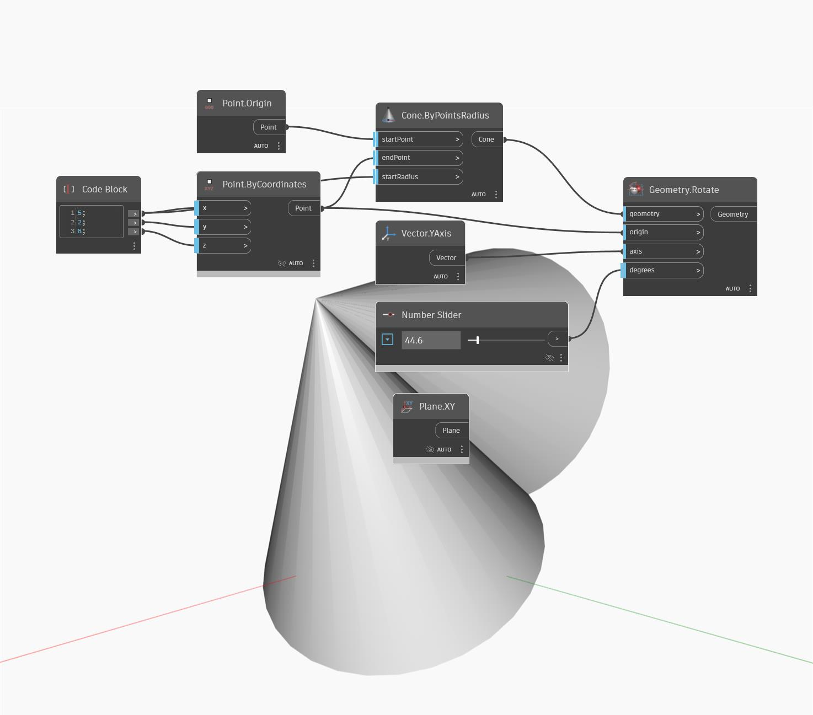

<!--- Autodesk.DesignScript.Geometry.Geometry.Rotate(origin, axis, degrees) --->
<!--- CGMTJF4G5CTK6EB36WTQMM4CXAQI7MUY7663A6FKXLX43NPGZ2VA --->
## In profondità
Ruota un oggetto attorno ad un'origine e ad un asse per un grado specificato.
___
## File di esempio

