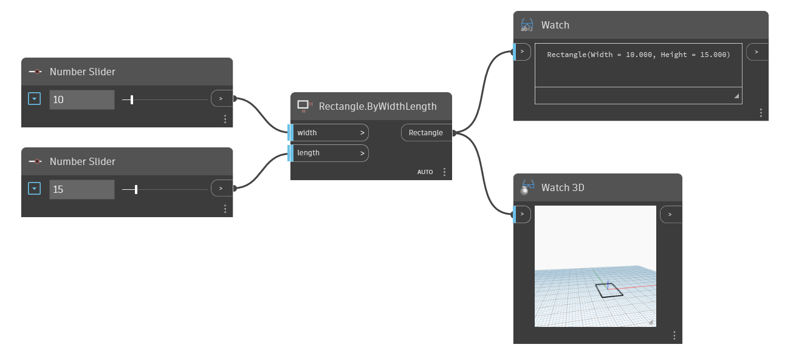

<!--- Autodesk.DesignScript.Geometry.Rectangle.ByWidthLength(width, length) --->
<!--- CMTCHCAMGXJZYOGATCJYXZM5UMWN5Y5GZ22WIK5267BVMYHEGSCQ --->
## In profondità
Il nodo Rectangle.ByWidthLength crea un rettangolo sul piano di base Z con una quota di lunghezza e larghezza specificate. Il centro del rettangolo verrà posizionato in corrispondenza dell'origine della griglia. In questo esempio, vengono utilizzati due Number Slider per controllare la forma del rettangolo.
___
## File di esempio

