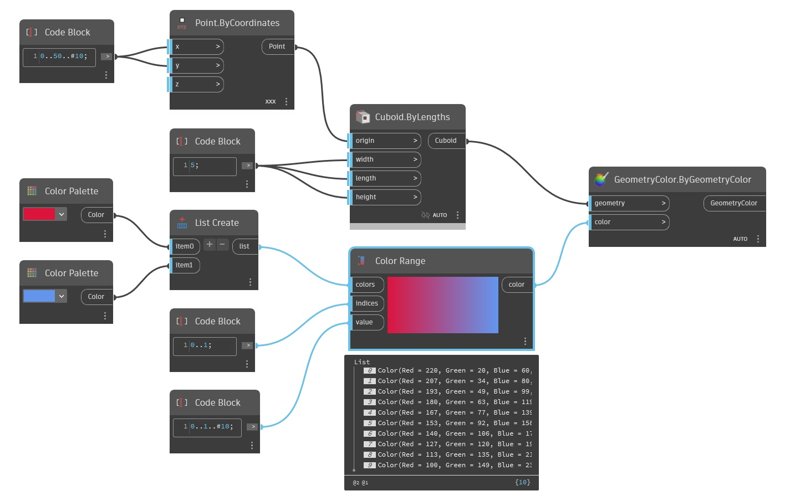

## In profondità
ColorRange creerà una sfumatura tra un insieme di colori di input e consentirà di selezionare i colori di tale sfumatura da un elenco di valori di input. Il primo input, colors, è un elenco di colori da utilizzare nella sfumatura. Il secondo input, indices, determinerà la posizione relativa dei colori di input nella sfumatura. Questo elenco dovrebbe corrispondere all'elenco di colori, in cui ogni valore è incluso nell'intervallo compreso tra 0 e 1. Il valore esatto non è importante, ma solo la posizione relativa dei valori. Il colore corrispondente al valore più basso si troverà a sinistra della sfumatura e il colore corrispondente al valore più alto si troverà sul lato destro della sfumatura. L'input final values consente all'utente di selezionare i punti lungo la sfumatura nell'intervallo compreso tra 0 e 1 per l'output. Nell'esempio seguente, vengono creati due colori: rosso e blu. L'ordine di questi colori nella sfumatura è determinato da un elenco creato con un Code Block. Un terzo Code Block viene utilizzato per creare un intervallo di numeri compreso tra 0 e 1 che determinerà i colori di output dalla sfumatura. Viene generato un insieme di cubi lungo l'asse x e questi cubi vengono infine colorati in base alla sfumatura utilizzando un nodo Display.ByGeometryColor.
___
## File di esempio

