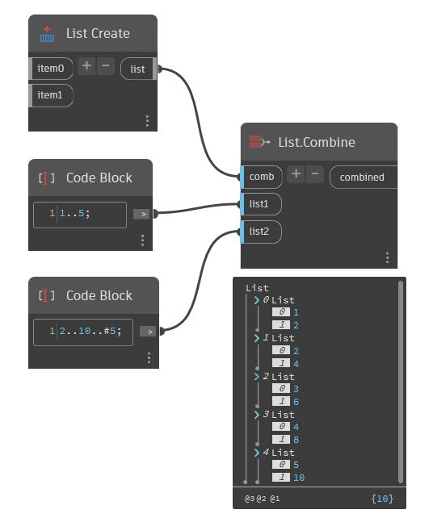

## In profondità
Combina unirà più input in un'unica stringa. Nell'esempio seguente, viene utilizzato un DirectorPath per selezionare una directory. È possibile specificare un nome di file utilizzando un Code Block. Viene quindi utilizzato un nodo Combine per unire il percorso della directory e il nome del file in un percorso di file.
___
## File di esempio

