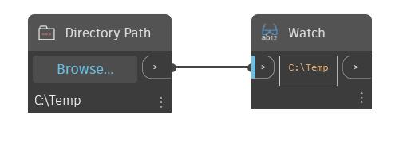

## In profondità
Directory consente all'utente di selezionare una directory dal suo computer. Per impostare il percorso della directory, fare clic sul pulsante Sfoglia... nel nodo Directory, quindi individuare la directory desiderata. Se il nodo viene aggiunto ad un file .dyn salvato in precedenza, per default verrà utilizzata la directory del file .dyn.
___
## File di esempio

