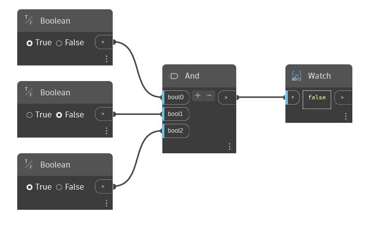

## In profondità
And utilizzerà un numero variabile di input booleani. È possibile aumentare o diminuire il numero di input utilizzando i pulsanti '+' e '-' sul nodo And. Ogni input deve essere un singolo valore booleano. And restituirà "true" se tutti gli input sono true, altrimenti restituirà "false". Nell'esempio seguente, sono disponibili tre pulsanti di commutazione booleani utilizzati come input per un nodo And. Quando tutti e tre sono impostati su "true", And restituirà "true".
___
## File di esempio

