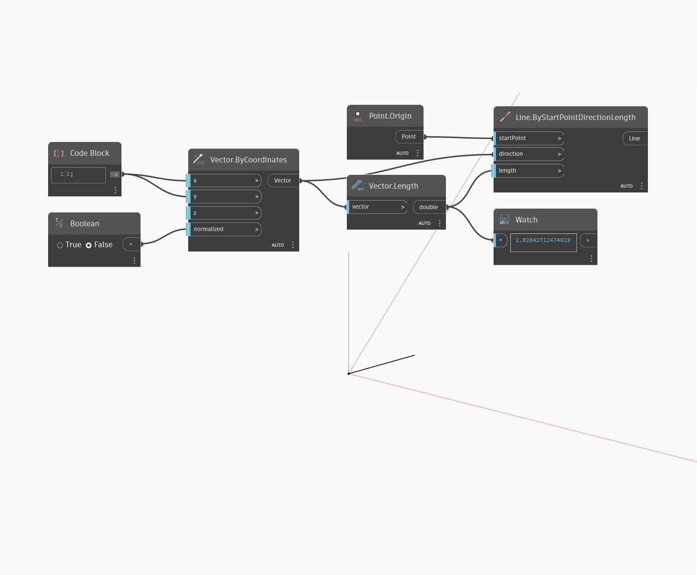

<!--- Autodesk.DesignScript.Geometry.Vector.ByCoordinates(x, y, z, normalized) --->
<!--- D37XBKNJBX5AZGHXPUHHK5DDGNDHLDGPI2QPK63TZHRZVREQ6MNA --->
## In profondità
ByCoordinates (x, y, z, normalized) restituirà un vettore dai valori delle coordinate e un pulsante di commutazione booleano normalizzato. Nell'esempio seguente, viene restituito un vettore con una lunghezza di 2.83 che può essere normalizzata su 1. Il vettore è rappresentato come una linea per mostrare la modifica della lunghezza quando si attiva/disattiva la normalizzazione.
___
## File di esempio

