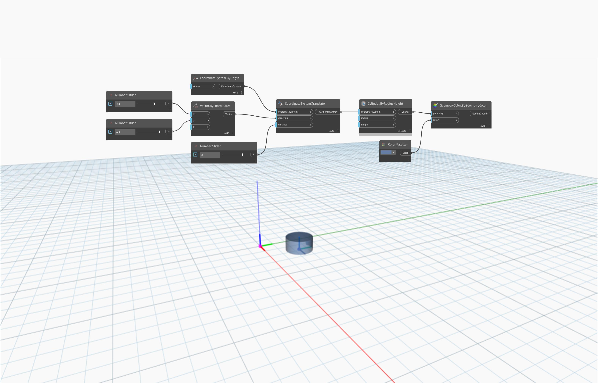

<!--- Autodesk.DesignScript.Geometry.CoordinateSystem.Translate(coordinateSystem, direction, distance) --->
<!--- D7TPJG7RLZUUPHJENWETOGTAX7U3ZWFXG4BAAHEGVXCRSUW3IVCQ --->
## In profondità
`CoordinateSystem.Translate (coordinateSystem, direction, distance)` restituisce un nuovo CoordinateSystem convertito da un vettore di input e una distanza.

Nell'esempio seguente, un CoordinateSystem in corrispondenza dell'origine viene convertito in una direzione dal vettore di input (3.1, 4.1, 0) e da una distanza di 3. L'input `distance` sostituisce la lunghezza dell'input `vector`. Il nuovo CoordinateSystem viene identificato con un cilindro creato su di esso.

___
## File di esempio

