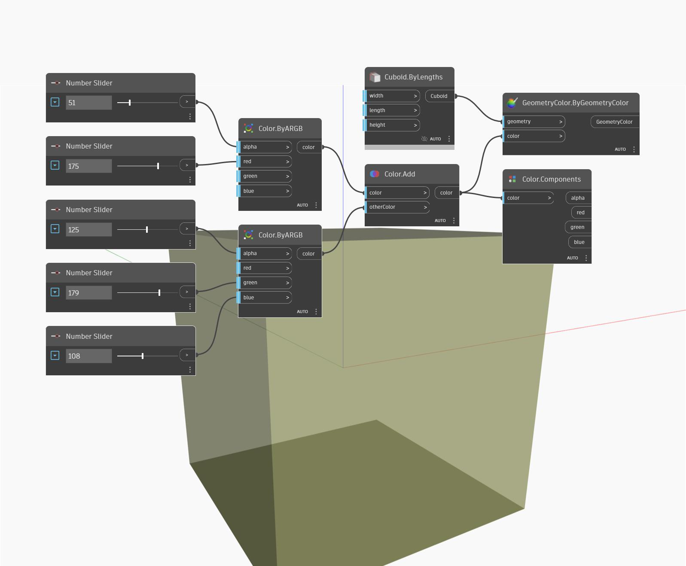

## In profondità
Components restituirà i giorni, le ore, i minuti e così via di un TimeSpan. Nell'esempio seguente, un TimeSpan di 5:16:21 restituisce 0 giorni, 5 ore, 6 minuti, 21 secondi e 0 millisecondi.
___
## File di esempio

