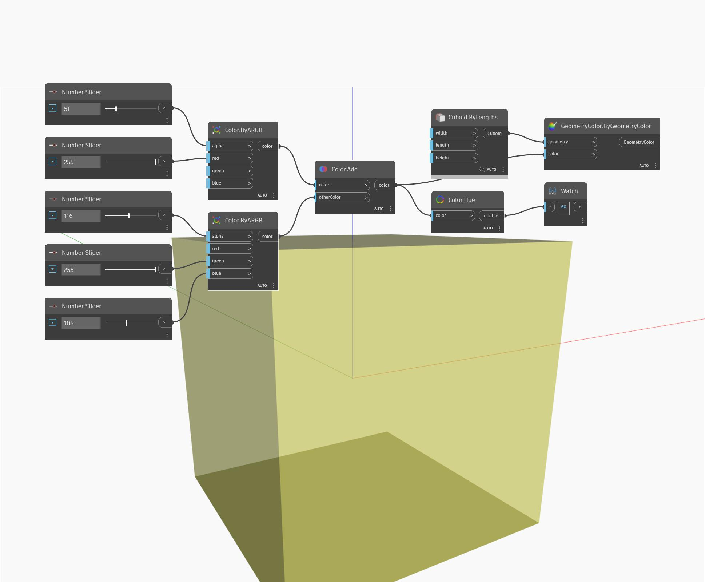

## In profondità
Hue restituirà il valore di tonalità di un colore di input. Nell'esempio seguente, vengono creati due colori utilizzando i nodi ByARGB, quindi vengono aggiunti i due colori insieme. Il valore di tonalità del colore risultante si trova utilizzando un nodo Hue.
___
## File di esempio

