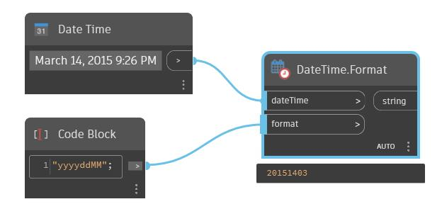

## In profondità
Restituisce una data e un'ora specificate come stringa nel formato specificato. Utilizza le stringhe di formato per una ricerca del formato data/ora MSDN nella descrizione.
___
## File di esempio

