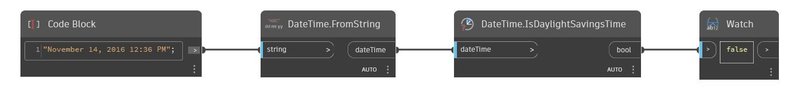

## In profondità
IsDaylightSavingsTime restituirà un valore booleano in base al fatto che dateTime rientra nell'ora legale. Nell'esempio seguente, dateTime di Novembre 14, 2016 12:36 PM restituisce false.
___
## File di esempio

