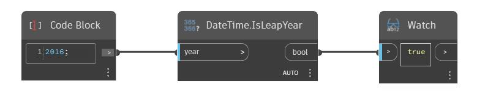

## In profondità
IsLeapYear restituirà un valore booleano a seconda che dataTime rientri o meno in un anno bisestile. Nell'esempio seguente, dateTime di 2016 restituisce true.
___
## File di esempio

