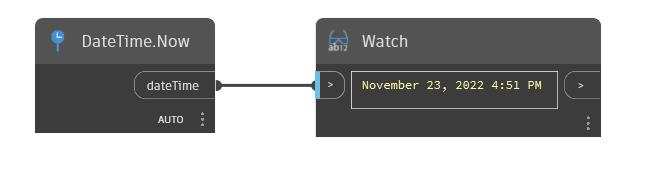

## In profondità
Now restituirà la data e l'ora correnti del sistema. Nel file di esempio seguente, viene mostrato Now che restituisce Novembre 14, 2016 12:48 PM alla creazione.
___
## File di esempio

