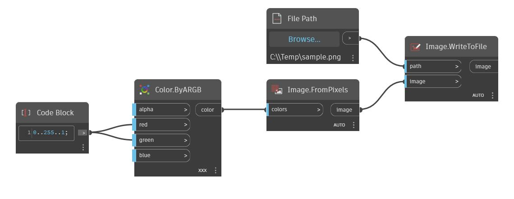

## In Depth
WriteToFile will return a List of Lists that is written to an Excel file. The sheet name, start row, and start column of where to write the data can be defined as inputs as well as whether existing data will be overwritten. In the example below, a List of Lists containing a number sequence is written to sampleexcel.xlsx starting at row 0 (or 1 in Excel) and column 1 (or B in Excel). The Excel file now has nine new columns with data in two existing rows. Screenshots of sampleexcel.xlsx before and after writing are overlaid to show the data in Excel's format.
___
## Example File

