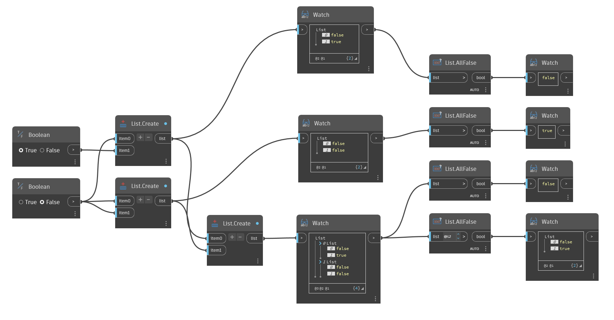

## In profondità
`List.AllFalse` restituisce False se qualsiasi elemento nell'elenco specificato è True o non un valore booleano. `List.AllFalse` restituisce True solo se ogni elemento nell'elenco specificato è un valore booleano e False.

Nell'esempio seguente, viene utilizzato `List.AllFalse` per valutare gli elenchi di valori booleani. Il primo elenco ha un valore True, quindi viene restituito False. Il secondo elenco ha solo valori False, pertanto viene restituito True. Il terzo elenco ha un sottoelenco che include un valore True, pertanto viene restituito False. Il nodo finale valuta i due sottoelenchi e restituisce False per il primo sottoelenco perché ha un valore True e True per il secondo sottoelenco perché ha solo valori True.
___
## File di esempio

