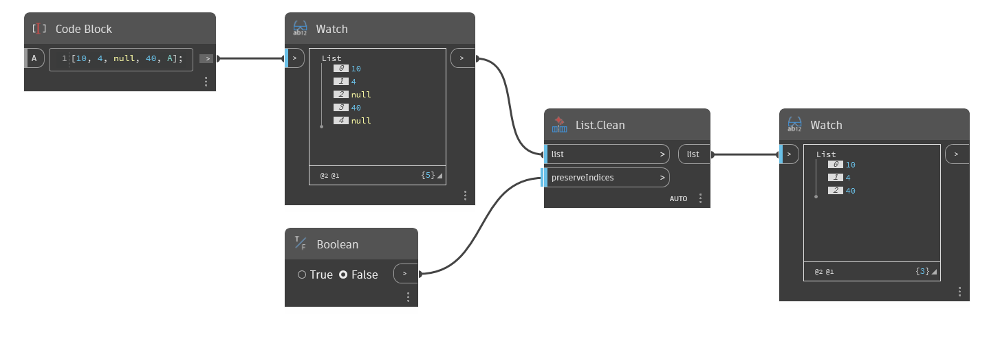

## In profondità
`List.Clean` restituisce un elenco senza valori null ed elenchi vuoti.

Nell'esempio seguente, `List.Clean` rimuove due valori null da un elenco, restituendo solo i numeri interi. L'input `preserveIndices` può essere attivato da un valore booleano per mantenere gli indici che una volta contenevano valori null.
___
## File di esempio

