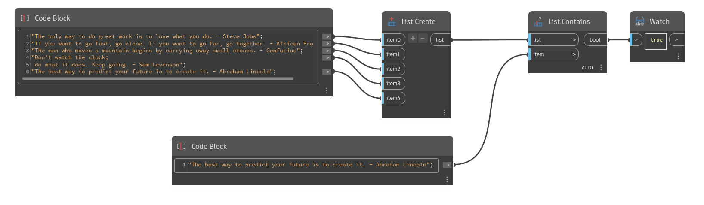

## In profondità
`List.Contains` restituisce un valore False se l'elenco non include l'elemento specificato e True se lo fa.

Nell'esempio seguente, viene creato un elenco di citazioni famose, quindi viene utilizzato `List.Contains` per verificare se l'elenco include una citazione specifica.
___
## File di esempio

