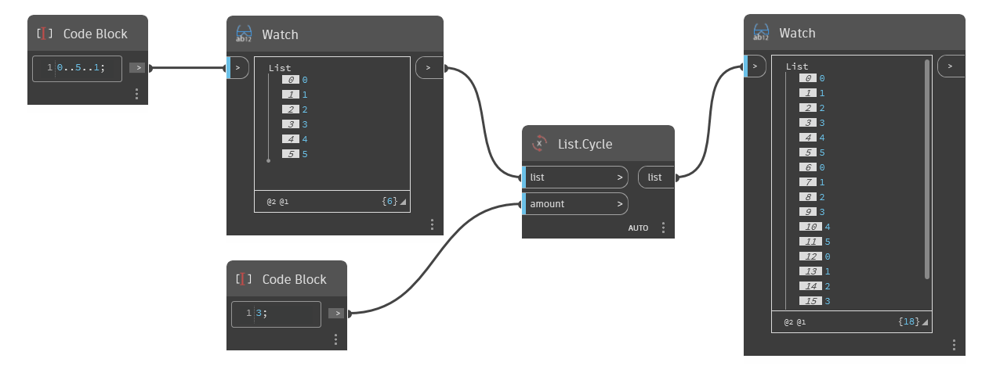

## In profondità
`List.Cycle` utilizza un elenco di input e restituisce un nuovo elenco costituito dall'elenco di input ripetuto per il numero di volte specificato dall'input `amount`.

Nell'esempio seguente, prima viene utilizzato un blocco di codice per generare un intervallo di numeri da 0 a 5, con incrementi di 1. Viene quindi utilizzato un nodo `List.Cycle` con un valore di input pari a 3. Il risultato è un elenco con 18 elementi, costituito da 3 cicli dell'elenco originale.
___
## File di esempio

