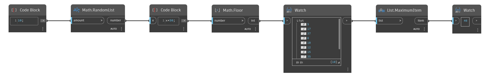

## In profondità
`List.MaximumItem` esegue una ricerca in un elenco di valori e restituisce l'elemento con il valore più alto.

Nell'esempio seguente, viene generato un elenco di 10 numeri casuali compresi tra 0 e 49. Verrà quindi utilizzato un nodo `List.MaximumItem` per trovare l'elemento più grande nell'elenco.
___
## File di esempio

