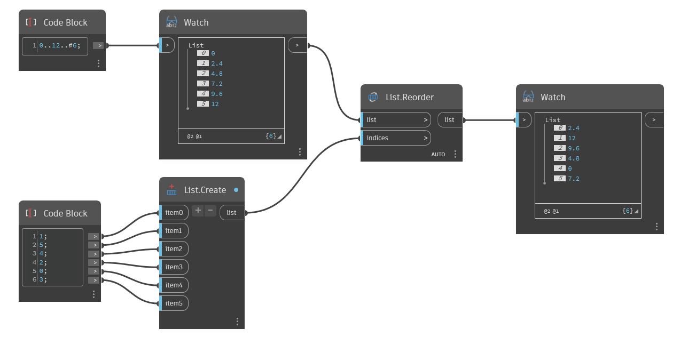

## In profondità
`List.Reorder` restituisce un nuovo elenco con i relativi elementi riordinati in base ad un elenco di indici.

Nell'esempio seguente, viene creato un nuovo elenco modificando manualmente l'ordine di indice. Ogni indice di input assegna una nuova posizione nell'elenco per gli elementi dell'elenco originale. Ad esempio, item0 è 1, pertanto il primo elemento del nuovo elenco è 2.4, che è indice 1 nell'elenco originale. Item1 è 5, quindi il secondo elemento del nuovo elenco è 12, che è indice 5 nell'elenco originale e così via.
___
## File di esempio

