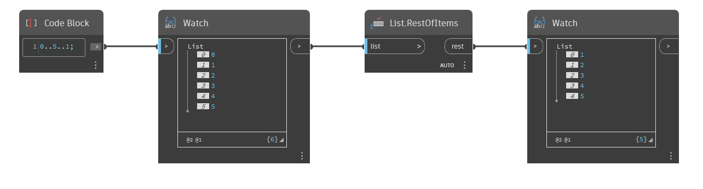

## In profondità
`List.RestOfItems` rimuove il primo elemento da un elenco e restituisce gli elementi rimanenti in un nuovo elenco.

Nell'esempio seguente, si inizia con un intervallo di numeri compreso tra 0 e 5, con incrementi di 1. Utilizzando un nodo `List.RestOfItems`, si rimuove il primo elemento dell'elenco e l'output è un elenco di numeri compresi tra 1 e 5.
___
## File di esempio

