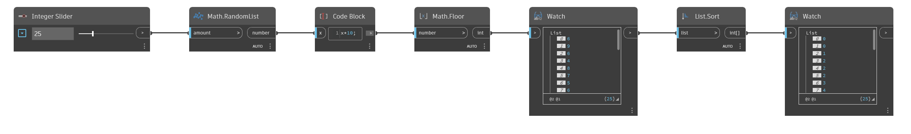

## In profondità
`List.Sort` organizza un elenco di elementi in base all'ordinamento incorporato per il tipo di dati. Ad esempio, un elenco di numeri viene ordinato dal più piccolo al più grande, mentre un elenco di stringhe viene ordinato in senso alfabetico.

Nell'esempio seguente, viene utilizzato `Math.RandomList` per generare innanzitutto un elenco di numeri casuali compresi tra 0 e 1. Viene quindi moltiplicato per 10 e viene utilizzata un'operazione `Math.Floor` per ottenere un elenco di numeri interi casuali compreso tra 0 e 9. `List.Sort` quindi crea un elenco ordinato dal numero più piccolo al più grande.
___
## File di esempio

