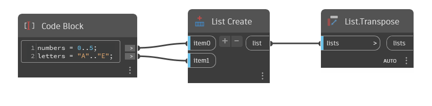

## In profondità
`List.Transpose` scambia le righe e le colonne in un elenco di elenchi. Ad esempio, un elenco contenente 5 sottoelenchi di 10 elementi ciascuno verrà convertito in 10 elenchi di 5 elementi ciascuno. Vengono inseriti valori null in base alle esigenze per garantire che ogni sottoelenco abbia lo stesso numero di elementi.

Nell'esempio, vengono generati un elenco di numeri da 0 a 5 e un altro elenco di lettere da A ad E. Per combinarli, viene quindi utilizzato `List.Create`. `List.Transpose` genera 6 elenchi di 2 elementi ciascuno, un numero e una lettera per elenco. Tenere presente che poiché uno degli elenchi originali era più lungo dell'altro, `List.Transpose` ha inserito un valore null per l'elemento non associato.
___
## File di esempio

