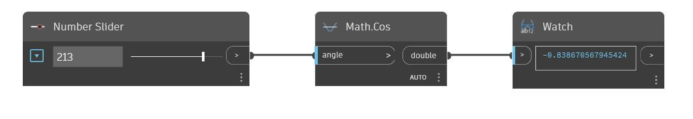

## In profondità
Cos restituirà il coseno di un input angle in gradi. Nell'esempio seguente, si utilizza un Number Slider impostato sull'intervallo compreso tra -360 e 360 per controllare l'input angle per un nodo Cos.
___
## File di esempio

