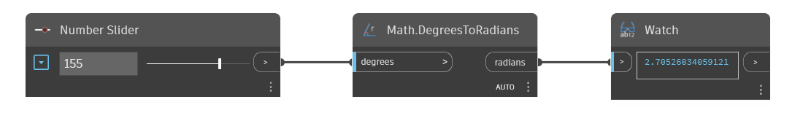

## In profondità
`Math.DegreesToRadians` converte un angolo di input da gradi in radianti.

Nell'esempio seguente, viene utilizzato un Number Slider impostato sull'intervallo compreso tra -360 a 360 per controllare l'angolo di input per un nodo `Math.DegreesToRadians`.
___
## File di esempio

