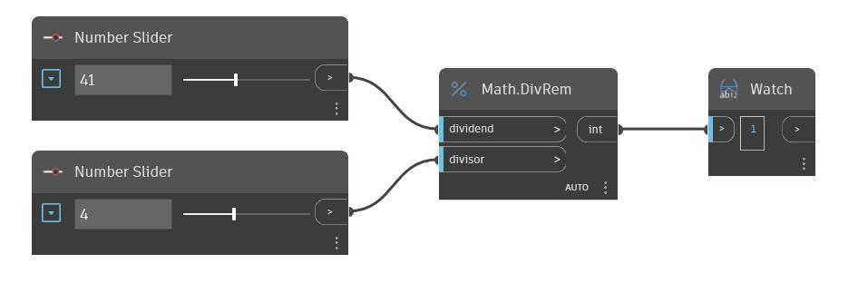

## In profondità
DivRem restituirà il resto di un numero di input dopo la divisione per un determinato divisore. È noto anche come modulo ed è equivalente all'operatore '%'. Nell'esempio seguente, vengono utilizzati due Number Slider per impostare il dividendo e il divisore per un nodo DivRem.
___
## File di esempio

